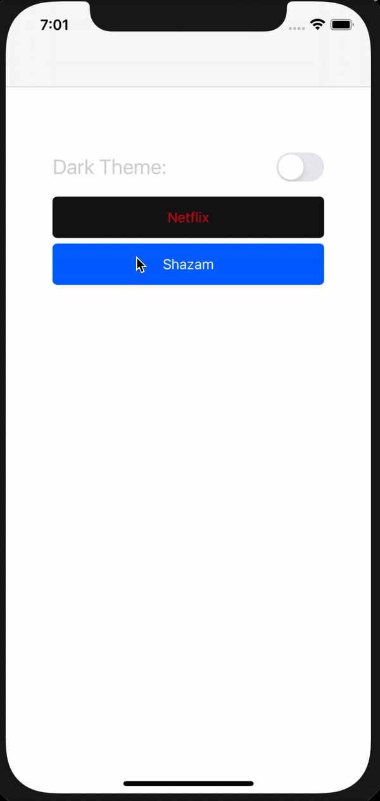

# XamarinForms Popular App UI Clones

Clones of popular application's UI in Xamarin Forms.

<table>
<tbody>
<tr>
<td>App</td>
<td>iOS</td>
<td>Android</td>
</tr>
<tr>
<td>
Netflix
</td>
<td>

 </td>
<td>

</td>
</tr>
<td>
Shazam
</td>
<td>

 </td>
<td>

</td>
</tr>
</tbody>
</table>